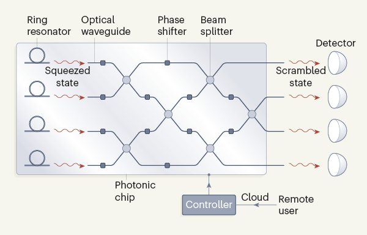
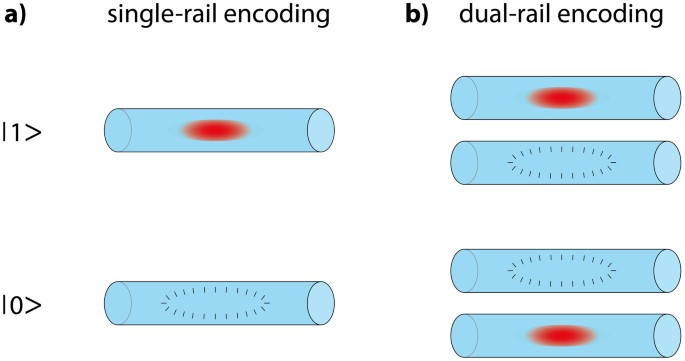
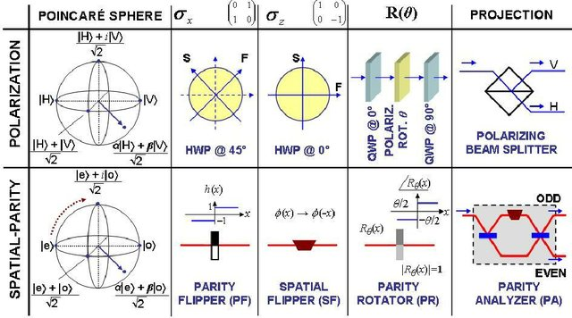
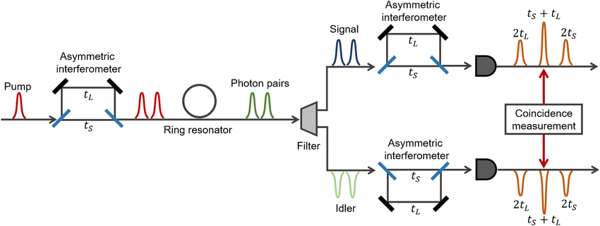
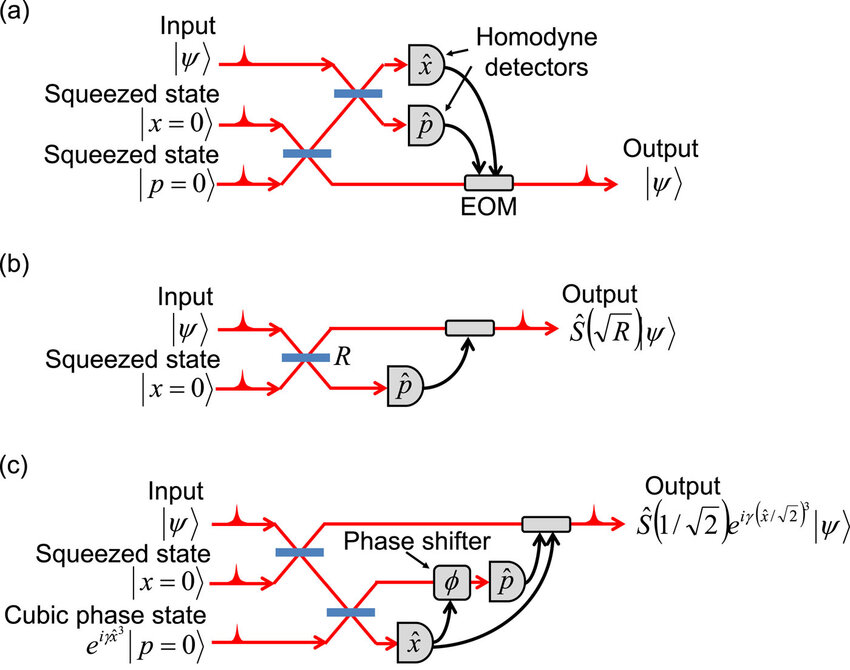
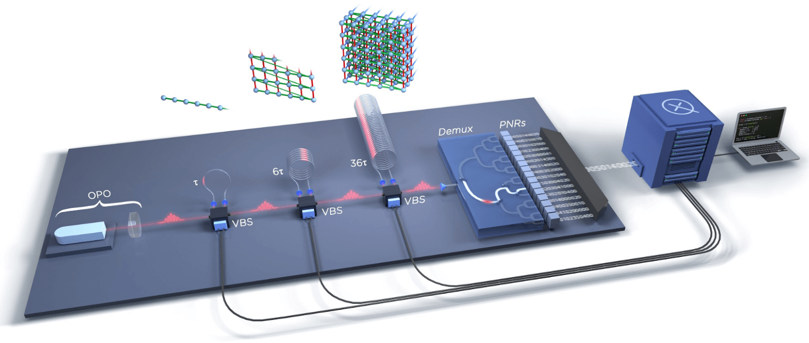

# Photonic Qubits

## Introduction

Photonic qubits are a class of quantum information carriers that use individual photons—particles of light—to encode and manipulate quantum states. They typically store information in properties such as polarization, path, or arrival time, leveraging the quantum nature of light. Because photons interact weakly with the environment, they exhibit exceptional coherence times and can be transmitted over long distances with minimal loss, making them ideal for quantum communication and linear optical quantum computing (LOQC). However, this same weak interaction presents a challenge for creating deterministic quantum gates, necessitating probabilistic methods, ancillary photons, and postselection strategies.

Integrated photonic platforms based on materials like silicon nitride and lithium niobate have enabled scalable on-chip architectures with thousands of components, supporting the development of practical photonic quantum processors. Companies such as Xanadu (with Borealis) and PsiQuantum are actively pursuing large-scale photonic quantum computing with ambitious roadmaps toward fault-tolerance and universal quantum computation.

  
  
<em>
  Figure 1: Schematic of a Photonic Quantum Processor
  <em>

 💡 Beginner Fact: What makes photonic gates special?

 Photons don’t interact easily, so we trick them into performing logic gates using clever setups like beam splitters and postselection.

## Key Properties of Photonic Qubits

This table summarizes the core characteristics of photonic qubits, helping to compare them with other qubit modalities. Their naturally high coherence and compatibility with telecom technologies make them especially useful for long-distance applications and modular designs.

| Property              | Description                                                           |
| --------------------- | --------------------------------------------------------------------- |
| Physical System       | Single photons in modes (polarization, path, time-bin, quadratures)   |
| Encoding Types        | Dual-rail, polarization, time-bin, continuous-variable                |
| Gate Mechanism        | Linear optics, beam splitters, postselection, cluster-state MBQC      |
| Coherence             | Very high (photons are nearly decoherence-free in vacuum)             |
| Noise Sources         | Photon loss, mode mismatch, detector inefficiencies                   |
| Platform Materials    | Silicon nitride, lithium niobate, gallium arsenide, photonic crystals |
| Control Techniques    | Feedforward, adaptive measurements, real-time reconfiguration         |
| Scalability Potential | High, with integrated photonics and multiplexed architectures         |

## Variants of Photonic Qubit Encodings

Photon-based quantum information can be encoded in several ways depending on the platform and application. Each encoding strategy has specific trade-offs related to stability, scalability, and gate implementation.

### 1. Dual-Rail Encoding

Dual-rail encoding uses a single photon distributed over two spatial or temporal modes to represent the logical states |0⟩ and |1⟩. This approach is conceptually straightforward and naturally suited to waveguide-based platforms. The presence of the photon in one mode implies a logical 0, and in the other, a logical 1. It enables reliable qubit manipulation using beam splitters and interferometers.

- **Pros**: Simple to implement with waveguides and beam splitters.
- **Cons**: Requires active stabilization to avoid mode drift.
- **Example**: Path-encoded qubits in silicon photonic chips.

  
  
<em>
  Figure 2: Dual-Rail Encoding Diagram
  <em>

 📘 Beginner Note

 Think of it like a photon traveling down one of two wires—presence in wire A means 0, in wire B means 1.

### 2. Polarization Encoding

Polarization encoding leverages the intrinsic property of photons where the electric field oscillates in particular directions. Horizontal and vertical polarizations—or circular polarizations—are mapped to |0⟩ and |1⟩ states. This method is compact and doesn't require spatial separation, making it suitable for free-space and fiber-based setups.

- **Pros**: Compact, avoids spatial separation.
- **Cons**: Polarization can drift in fiber optics or integrated waveguides.
- **Example**: Polarization qubits used in quantum key distribution (QKD).

  
  
<em>
  Figure 3: Polarization Encoding in Fiber
  <em>

 📘 Beginner Note

Imagine polarized sunglasses that only let certain directions of light through—qubits use similar polarization.

### 3. Time-Bin Encoding

Time-bin encoding represents quantum states using the temporal arrival of photons—early or late relative to a clock cycle. This approach is particularly resilient in optical fiber networks, where polarization and phase noise are common. It requires precise timing systems and detectors capable of resolving individual photon arrival times.

- **Pros**: Very stable for long-distance fiber communication.
- **Cons**: Requires precise time-resolved detection.
- **Example**: Used in fiber-based quantum communication networks.

  
  
<em>
  Figure 4: Schematic diagram of the generation and measurement of time-bin entangled states.
  <em>

 📘 Beginner Note 

Like sending Morse code pulses—early pulse is 0, late pulse is 1.

 💡 Beginner Fact

Time-bin encoding works so well in fiber because it doesn’t get scrambled like polarization does.

### 4. Continuous-Variable (CV) Encoding

Continuous-variable encoding departs from discrete qubit states and instead encodes information in the continuous properties of the light field, such as the amplitude and phase quadratures. These are manipulated using squeezing and homodyne detection. CV systems allow for deterministic operations and high data throughput but are more sensitive to Gaussian noise and losses.

- **Pros**: Deterministic operations and compatibility with existing telecom infrastructure.
- **Cons**: Susceptible to Gaussian noise and loss.
- **Example**: Used in CV cluster-state quantum computation.

  
  
<em>
  Figure 5: CV quantum teleportation and its extension to quantum gates. 
  <em>

 📘 Beginner Note

Instead of flipping bits, think of tuning analog dials with high precision.

## Decoherence and Noise Sources

While photons are inherently immune to many decoherence mechanisms, real-world implementations must contend with technical imperfections. Losses from coupling inefficiencies, waveguide imperfections, and absorption can degrade performance.

Common noise mechanisms include:

- **Photon Loss**: Photons may be absorbed or scattered during transmission.
- **Mode Mismatch**: Imperfect interference due to distinguishable photons.
- **Detector Inefficiency**: Loss of information if photons are not accurately detected.
- **Phase Drift**: Affects time-bin and dual-rail encodings in integrated platforms.

Mitigation strategies include:

- Bosonic error correction codes (e.g., GKP codes)
- Redundancy using repetition codes
- Real-time feedforward and active reconfiguration
- High-efficiency detectors like SNSPDs

🛠️ Beginner Tip

Imagine each photon as a fragile messenger—you need ultra-precise tools to catch and correct its path.

## Experimental Progress

Photonic quantum hardware has progressed rapidly due to advancements in integrated optics, photon sources, and detectors. Research groups and companies are demonstrating increasing levels of photonic entanglement, gate complexity, and programmability.

- **Xanadu's Borealis**: Demonstrated programmable Gaussian boson sampling on >200 modes.
- **PsiQuantum**: Pursuing fault-tolerant photonic quantum computers using silicon photonics.
- **UCSB, MIT, and University of Bristol**: Pioneered early cluster-state photonic experiments.
- **Recent Advances**:
  - High-purity photon sources using quantum dots in microcavities
  - On-chip reconfigurable interferometers
  - Time-bin encoded cluster states on integrated platforms

  
  
<em>
  Figure 6: Xanadu Borealis Architecture 
  <em>

🔬 Beginner Fact

Borealis isn’t a full computer yet, but it demonstrates key building blocks like photonic interference and programmability.

## Further Reading

- [PhysRevX: Linear Optical Quantum Computing](https://journals.aps.org/prx/abstract/10.1103/PhysRevX.5.041007) – A comprehensive overview of the theoretical framework.
- [Science Advances: On-demand Single Photon Sources](https://www.science.org/doi/10.1126/sciadv.abn9252) – Discussion of quantum dot photon sources.
- [PRL: Real-Time Error Correction in CV Systems](https://journals.aps.org/pra/abstract/10.1103/PhysRevA.101.012316) – Strategies for fault tolerance.
- [Nature: Modular Photonic Quantum Computing](https://www.nature.com/articles/s41586-024-08406-9) – Roadmap and design of modular architectures.
- [QuEra Glossary: Photonic Qubits](https://www.quera.com/glossary/photonic-qubits) – Beginner-friendly glossary with visual aids.
