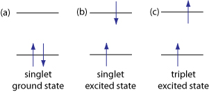

# Silicon Spin Qubits Documentation

Silicon spin qubits are a promising qubit modality built on the foundation of well-established CMOS-compatible silicon semiconductor technology. These systems encode quantum information in the spin states of electrons confined in quantum dots.

## 🧠 What is a Silicon Spin Qubit?

A silicon spin qubit stores quantum information in the spin state (up |↑⟡ or down |↓⟡) of a single electron in a silicon-based quantum dot. These qubits leverage technologies already used in classical computing hardware.

- **Platform**: Gate-defined quantum dots in Si/SiGe or Si-MOS heterostructures
- **Control**: Electric and magnetic fields (microwave ESR or EDSR)
- **Readout**: Spin-to-charge conversion followed by charge sensing

 🧠 Beginner Note

Think of a quantum dot as a tiny trap where one electron can be held still and its spin manipulated like a compass needle.

  
  
<em>
  Figure 1: Illustration of a quantum dot holding a single electron.
  <em>

## 🔍 Variants of Silicon Spin Qubits

Quantum information in silicon spin systems can be encoded in different ways depending on how many electrons and quantum dots are used. Each variant offers unique trade-offs in terms of control complexity, noise resilience, and scalability.

### 1. Single-Electron Spin Qubit

- **Encoding**: Spin-½ state of one electron in a quantum dot
- **Control**: Electron spin resonance (ESR) or electric-dipole spin resonance (EDSR)
- **Pros**: Simple architecture, potential for long coherence times, high-fidelity gate control
- **Cons**: Sensitive to charge and magnetic noise, requires precise magnetic field gradients or microwave antennas

These qubits are closest in structure to classical CMOS elements and are considered among the most scalable spin qubit variants due to their compact footprint.

 📘 Example

A single electron confined in a gate-defined quantum dot is manipulated using ESR to rotate its spin state.

  
  
<em>
  Figure 2: Singlet pairs have antiparallel spins (⟨s₁⋅s₂⟩ = −¼), while triplet pairs have spins at ~70.5° with ⟨s₁⋅s₂⟩ = +¼.
  <em>

 🧠 Beginner Note

The electron acts like a tiny magnet. Rotating it with microwaves lets us perform quantum gates.

### 2. Singlet-Triplet Qubit

- **Encoding**: Two-electron spin states in a double quantum dot: singlet (|S⟡) and unpolarized triplet (|T₀⟡)
- **Control**: Electrostatic detuning controls exchange coupling between electrons
- **Pros**: Immune to global magnetic field fluctuations, purely electric control
- **Cons**: Requires precise tuning of the interdot coupling and suffers from charge noise near zero detuning

Singlet-triplet qubits utilize the anti-symmetric and symmetric combinations of two-electron spin states to define qubit states. The qubit is typically initialized into a singlet and manipulated via detuning pulses.

 📘 Example

Two adjacent quantum dots each hold one electron. Exchange coupling and magnetic gradients manipulate the energy gap between singlet and triplet states.

  
  
<em>
  Figure 3: Fluorescence occurs between same-spin states; phosphorescence involves a spin-flip transition.
  <em>

 🧠 Beginner Note

Singlet and triplet refer to how two electrons' spins align or oppose each other. Their energy difference is controllable using nearby gates.

### 3. Exchange-Only / Resonant Exchange Qubit

- **Encoding**: Three electrons in three quantum dots, with logical qubit encoded in a decoherence-free subspace of spin-½ states
- **Control**: Exchange interactions via voltage pulses on gates; no magnetic field or microwaves needed
- **Pros**: Fast all-electrical control, protection from certain noise types, suitable for compact qubit arrays
- **Cons**: Requires complex pulse sequences and precise symmetry to stay within encoded subspace

These qubits are promising for dense 2D arrays and are well-suited to architectures with high connectivity demands. The resonant exchange (RX) variant allows for resonant transitions using AC detuning.

 📘 Example

Three electrons are trapped in three adjacent quantum dots. Exchange interactions between them implement gate operations within a protected logical subspace.

  
  
<em>
  Figure 4: (a) Layout of a lateral triple quantum dot system. (b) Triple-well potential showing dot energies and detuning parameters ε and εₘ.
  <em>

 🧠 Beginner Note

Think of exchange-only qubits like a triangle of electrons. Tweaking their positions lets you rotate the logical qubit without using microwaves.

### 4. Flip-Flop Qubit

A flip-flop qubit is a hybrid silicon spin qubit that uses both the electron and nuclear spin of a single donor atom (e.g. phosphorus in silicon). The logical states are the flip-flop transitions between |↓↑⟡ and |↑↓⟡, representing electron and nuclear spins, respectively.

- **Encoding**: Mixed spin state of donor nucleus and bound electron
- **Control**: Electric fields shift the electron from the donor toward a gate-defined dot, enabling electric dipole transitions
- **Readout**: Spin-to-charge conversion via donor-dot tunnel coupling or resonator readout

This approach combines fast electrical control with long-lived memory. The electric dipole allows coupling to superconducting microwave resonators, opening paths to long-distance entanglement and modular architectures.

| Feature                | Advantage                                |
|------------------------|------------------------------------------|
| Strong electric dipole | Enables coupling to microwave cavities   |
| Long coherence         | Leverages the quiet nuclear spin system  |
| All-electrical control | Compatible with standard gate layouts    |

 📘 Example

A phosphorus donor sits beneath a silicon interface. A voltage pulls the electron toward a surface gate, hybridizing it with the donor nucleus.

  
  
<em>
  Figure 5: Sketch of a resonant CROT two-qubit gate using exchange interaction J and hyperfine coupling A, showing conditional spin rotations.
  <em>

 🧠 Beginner Note

Flip-flop qubits mix electron and nuclear spin states. This mix enables long memory (from the nucleus) and fast control (from the electron).

## 🛠️ Materials and Fabrication

- **Platforms**: 
  - Silicon metal-oxide-semiconductor (Si-MOS)
  - Silicon/silicon-germanium (Si/SiGe) heterostructures
- **Advantages**: CMOS-compatible, high-quality oxide interfaces, isotopically purified 28Si
- **Coherence**: Minimal hyperfine interaction = longer coherence times (> milliseconds)

 🧠 Beginner Note

Isotopically purified 28Si reduces magnetic noise from unwanted nuclear spins.

  
  
<em>
  Figure 6: Layered SiGe/Si/SiGe quantum dot structure with gate-defined electron confinement and corresponding electrostatic potential profile.
  <em>

## ⚠️ Decoherence and Noise Sources

| Noise Type             | Description                                                                 |
|------------------------|-----------------------------------------------------------------------------|
| Charge Noise           | From fluctuating charges at gate interfaces                                |
| Johnson Noise          | Thermal noise from resistive components                                    |
| Hyperfine Interaction  | Due to remaining 29Si nuclear spins, mitigated by isotope purification     |

- **Countermeasures**:
  - Improved fabrication
  - Dynamical decoupling pulse sequences
  - Encoded qubits (e.g., singlet-triplet)

 📘 Example

A Hahn echo sequence refocuses spin dephasing caused by slowly fluctuating noise.

  
  
<em>
  Figure 7: Illustration from Hahn's 1954 paper demonstrating the formation of an "eight-ball" echo.
  <em>

## 🎯 Gate Fidelities

| Gate Type       | Technique        | Typical Fidelity |
|------------------|------------------|------------------|
| Single-qubit     | ESR / EDSR       | >99.9%           |
| Two-qubit        | Exchange gates   | >99%             |

- **Gate operation time**: Typically in microseconds for exchange-based gates
- **Pulse shaping** and **interdot tuning** improve fidelity and suppress leakage

 🧠 Beginner Note

A gate is like a logic operation — just like a NOT gate in classical computing flips a bit, a quantum gate flips or rotates a qubit's state.

## 🧪 Experimental Progress

- **Coherence Times**: Up to 10 ms in isotopically purified 28Si (Nature, 2021)
- **Industrial CMOS Scaling**: Demonstrated by global semiconductor fabs
- **Multiqubit Devices**: Crossbar arrays, scalable qubit tiles, and integration with classical electronics

 📘 Example

A 2x2 silicon spin qubit array fabricated in a commercial 300mm CMOS foundry (see [Nature Communications](https://www.nature.com/articles/ncomms13575)).

## 📚 Further Reading and Lectures

- [A CMOS silicon spin qubit – Nature Communications](https://www.nature.com/articles/ncomms13575)
- [Silicon spin qubits manufactured on an industrial scale – Physics World](https://physicsworld.com/a/silicon-spin-qubits-manufactured-on-an-industrial-scale)
- [Silicon spin qubits: Nature article on long coherence times](https://www.nature.com/articles/s41467-023-36031-z)

