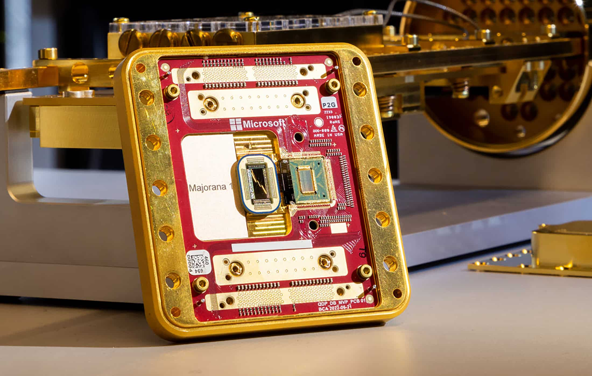
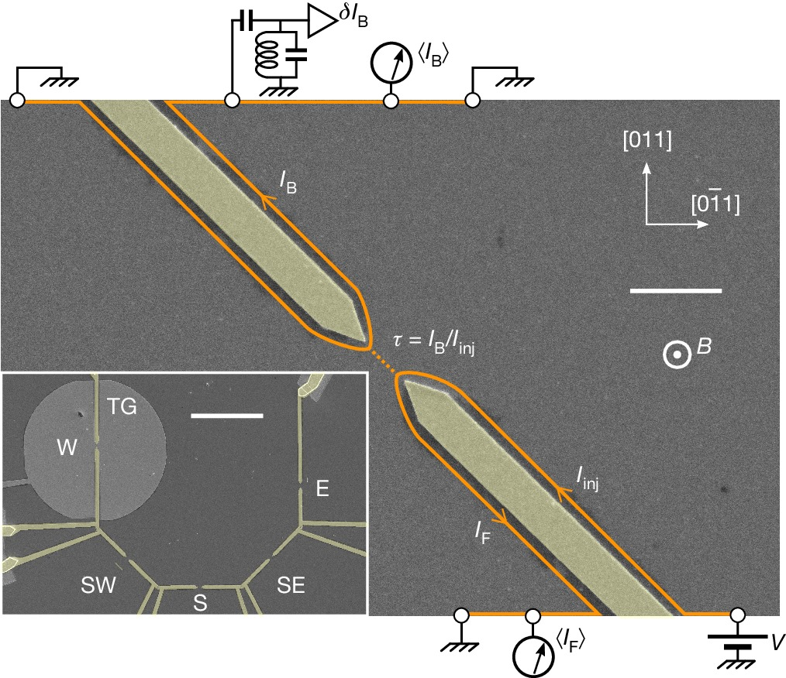

## 🧩 Topological Qubits

Topological qubits store quantum information in global states formed by non-Abelian anyons, such as **Majorana zero modes** or **Fibonacci anyons**, instead of local physical degrees of freedom. These exotic quasiparticles arise in specially engineered quantum materials that support topological phases of matter. A core benefit of topological qubits is their **intrinsic resistance to local noise and decoherence**, potentially reducing the need for extensive error correction.

Topological qubit candidates include **Majorana nanowires**, **fractional quantum Hall systems**, and **topological surface codes**. While theoretical models show strong protection properties, experimental systems are still in the proof-of-concept stage, often requiring **ultra-low temperatures (\~10 mK)** and advanced fabrication techniques.

## 🔹 Qubit Encoding and Operations

- **Physical States**: Qubits are stored in joint parities or fusion spaces of anyons
- **System Hamiltonians**: Governed by models such as the Kitaev chain
- **Gate Operations**: Performed via braiding (topologically protected) or parity measurements

## ⚙️ Physical Realizations

| Platform              | Encoding        | Gates            | Readout        | Status                   |
| --------------------- | --------------- | ---------------- | -------------- | ------------------------ |
| Majorana Nanowires    | Fermion parity  | Braiding, parity | Charge sensors | Microsoft prototype (8Q) |
| Fractional QHE Anyons | Fusion space    | Braiding         | Interferometry | Experimental research    |
| Topological Codes     | Lattice defects | Braiding defects | Qubit parity   | Google/IBM logic demos   |

## 🔸 Majorana Nanowires (Kitaev Chain Model)

Majorana-based topological qubits use a 1D semiconducting nanowire (e.g., InAs, InSb) coupled to a superconductor (e.g., Al) and placed in a magnetic field. This setup realizes a **topological superconducting phase**, described by the Kitaev chain model:

$$H = \sum_{j} -\mu c_j^\dagger c_j - t(c_j^\dagger c_{j+1} + h.c.) + \Delta(c_j c_{j+1} + h.c.)$$

| Parameter   | Typical Value                            |
| ----------- | ---------------------------------------- |
| Temperature | \~10 mK                                  |
| Materials   | InAs/InSb nanowire + Al superconductor   |
| Gate Method | Braiding or parity measurement           |
| Status      | Prototype stage (Microsoft "Majorana 1") |

  
  
<em>
  Figure 1: Majorana Quantum Chip
  <em>

**Key Features**:

- Braiding MZMs implements Clifford gates
- Parity measurements offer measurement-based logic
- Operates at \~10 mK
- Actively researched by Microsoft, Delft, and UW–Madison

 🧠 Beginner Note

Each end of the wire hosts a Majorana zero mode, which is half of a regular fermion. The qubit is encoded in the joint parity of two such modes:

$$iγ₁γ₂ = 1 - 2n_f$$

Where $n_f$ is either 0 or 1 depending on parity. Because the modes are spatially separated, noise must act nonlocally to corrupt the qubit.

## 🔸 Fractional Quantum Hall Anyons (Fibonacci Anyons)

In **2D electron gases** under high magnetic fields and low temperatures, fractional quantum Hall (FQH) states emerge. At certain filling fractions (like ν=12/5), the system is predicted to host **Fibonacci anyons**, which are capable of **universal quantum computation** through braiding.

  
  
<em>
  Figure 2: Topological qubits can also be realized in fractional quantum Hall systems under strong magnetic fields
  <em>

**Concept:** Instead of electrons, the system supports collective excitations (anyons) that obey non-Abelian statistics. A qubit is stored in the fusion outcomes of anyon pairs.

| Property       | Description                            |
| -------------- | -------------------------------------- |
| Platform       | 2D electron gas (e.g., GaAs/AlGaAs)    |
| Control Method | Braiding, interferometry               |
| State Type     | Fusion space of Fibonacci anyons       |
| Status         | Theoretical & experimental exploration |

**Example:** If three Fibonacci anyons fuse, the resulting state depends on fusion order—this gives a topologically protected computational space.

 🧠 Beginner note: What are Fibonacci anyons?
 Fibonacci anyons are exotic quasiparticles whose braiding operations alone can perform any quantum gate, making them “universal” for quantum computation. 

## 🔸 Gate Implementation Techniques

Topological gates are achieved through any of the following:

- **Braiding**: Moving anyons around each other implements unitary gates.
- **Parity Measurement**: Read out fermion parity between anyons
- **Measurement-Only Braiding**: Logical operations via sequences of parity checks without moving anyons.

 🧠 Beginner Note

Unlike conventional gates, braided paths act like logic circuits. This is why topological gates are considered "hardware-level fault-tolerant".

## ⚠️ Decoherence & Practical Challenges

| Challenge               | Description                                               |
| ----------------------- | --------------------------------------------------------- |
| Quasiparticle Poisoning | Stray fermions enter and disrupt parity                   |
| Thermal Excitations     | Break topological protection if system not cold enough    |
| Small Topological Gap   | Makes system fragile to disorder and noise                |
| Verification Difficulty | Many experimental signatures are not uniquely topological |

Current error rates are not yet low enough for large-scale fault-tolerant computation, though some parity-protected subspaces have been demonstrated.

## 🔧 Error Correction Strategy

While topological systems aim to **minimize the need for error correction**, practical devices still incorporate standard protocols:

- Surface-code style lattices for logical qubits
- Parity measurement-based syndrome extraction
- Hybrid approaches with superconducting or spin qubits

## 📚 Further Reading

- [Lahtinen & Pachos – Anyons and Topological QC](https://arxiv.org/abs/1705.04103) — Great intro to anyons and fusion spaces
- [Microsoft Topological Architecture](https://arxiv.org/abs/2502.12252) — Recent implementation overview
- [Fibonacci Anyons in FQHE](https://www.nature.com/articles/s41586-024-07727-z)
- [UCSB News on Majorana Experiments](https://news.ucsb.edu/2025/021760/topological-quantum-processor-marks-breakthrough-computing)
