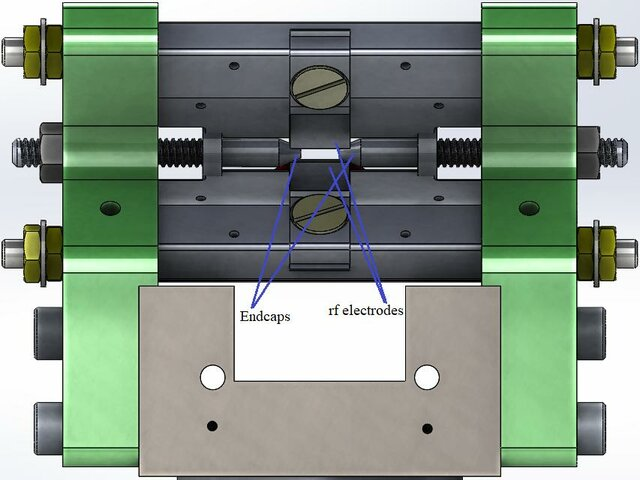
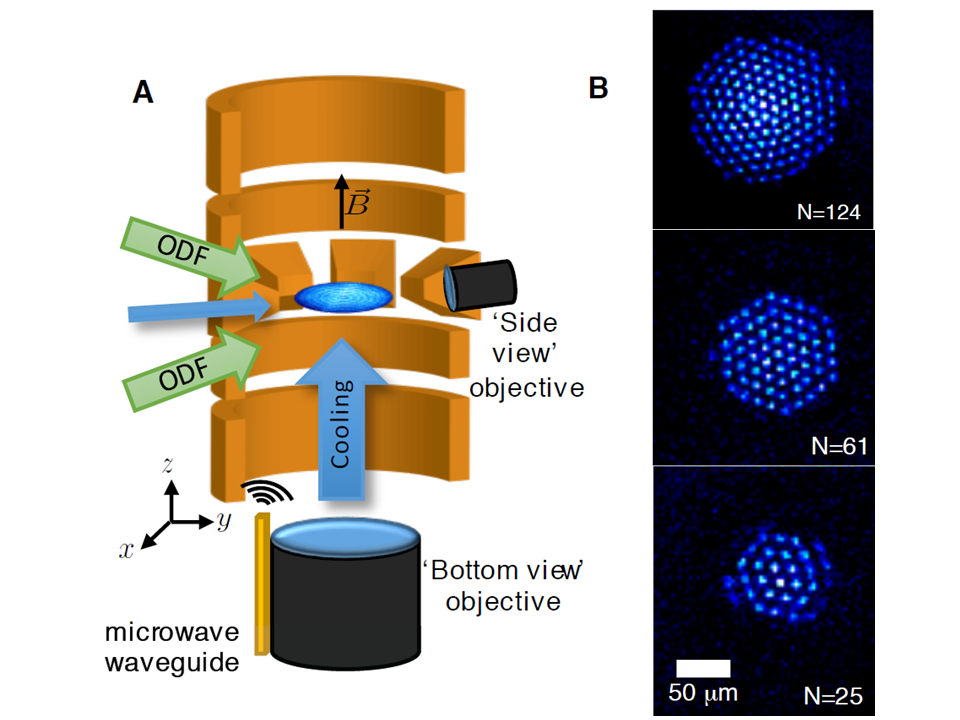
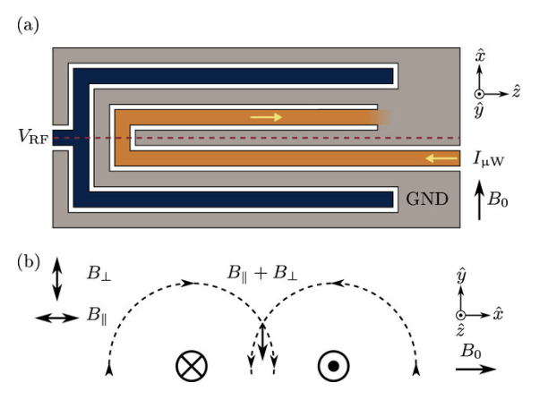
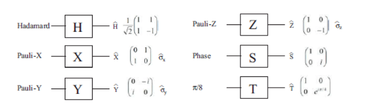
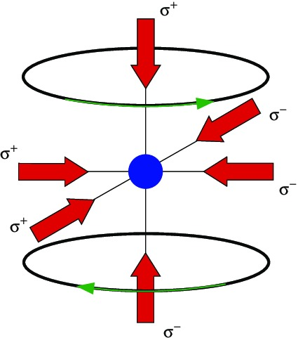

# 🔗 Trapped Ion Qubits

Trapped-ion quantum computers use **individual atomic ions** confined in electromagnetic fields inside **ultra-high vacuum chambers**. These ions are suspended in place using static and/or oscillating electric and magnetic fields, allowing them to serve as stable and controllable **qubits**.

Each qubit is typically encoded in long-lived atomic energy levels — such as **hyperfine or Zeeman sublevels** — of ions like `Yb⁺`, `Ca⁺`, `Be⁺`, or `Mg⁺`. These are manipulated with **precisely tuned lasers or microwaves** for initialization, control, entanglement, and readout.

Trapped-ion qubits are highly reliable due to their natural isolation from external noise. Think of them like extremely well-insulated musical tuning forks: once “struck” by a laser, they hold their tune (quantum state) for a long time.

## 🧲 Ion Trap Architectures

| Trap Type                  | Description                                 | Advantage                               |
| -------------------------- | ------------------------------------------- | --------------------------------------- |
| **Linear Paul Trap**       | Ions aligned in 1D by RF + DC fields        | Mature technology; high fidelity        |
| **Penning Trap**           | Ions form 2D crystals using magnetic fields | 2D scalability potential                |
| **Surface-Electrode Trap** | Ions trapped above microfabricated chips    | Chip-scale integration, CMOS-compatible |

🧠 Beginner Tip

Imagine holding a few ping pong balls in a row using invisible tweezers (electric fields). The balls don’t touch but can “talk” to each other by vibrating. That’s how ion traps work in simple terms.

### 🔹 Linear Paul Traps

Linear Paul traps are the most widely used architecture in trapped-ion systems. They consist of a combination of **radiofrequency (RF)** and **static (DC)** electric fields, configured using rod-shaped electrodes. The RF field provides radial confinement, while the DC field ensures axial confinement, resulting in a stable linear chain of ions.

- **Use Cases**: Ideal for small-to-medium-scale quantum processors.
- **Stability**: Excellent motional mode control.
- **Gate Design**: Highly compatible with Mølmer–Sørensen entangling gates.

  
  

  <em>
  Figure 1: A cross-sectional view of a linear Paul trap design in a CAD environment.
  </em>
  

💡 Example

Most commercial trapped-ion quantum computers (like IonQ’s system) are based on linear Paul traps.

### 🔹 Penning Traps

Penning traps employ **static magnetic and electric fields** to confine ions in two dimensions. Instead of oscillating RF fields, a strong magnetic field forces ions into a rotating crystal configuration, enabling 2D ion arrays — a promising direction for scaling.

- **2D Crystals**: Ions arrange themselves in hexagonal patterns.
- **Advantages**: No RF drive — reduced micromotion and heating.
- **Challenges**: Complex rotation control and limited individual addressing.

  
  
<em>Figure 2: (A) A cross-sectional illustration of the Penning trap. (B) Coulomb crystal images in a frame rotating with the 9^Be+ ions in upwards direction, with the number of ions N indicated.</em>

💡 Note

Penning traps are especially useful in quantum simulations of condensed matter physics.

### 🔹 Surface-Electrode (Planar) Traps

Surface-electrode traps feature **microfabricated electrode patterns on a planar chip**, allowing ions to float just above the chip’s surface. These designs are scalable and compatible with semiconductor manufacturing processes.

- **Miniaturization**: Enables trap arrays and junctions for routing ions.
- **Integration**: Can include photonic elements and control lines on-chip.
- **Challenges**: Higher motional heating rates near surfaces.

  
  
<em>
  Figure 3: (A) Top view of the surface trap showing RF, microwave, and ground electrodes; red dashed line is the RF null, 𝐵0 the static field.
  (B) Cross-section of magnetic field from microwave electrode currents.
  <em>

💡 Future Direction

These traps are ideal for building modular, large-scale systems with embedded optics and electronics — key for long-term scalability.

## 🧪 Qubit Physics

- **Qubit Species**: Common ions include:
  - `^{171}Yb⁺` – Hyperfine levels (microwave control)
  - `^{40}Ca⁺` – Optical transitions (laser control)
  - `^{9}Be⁺`, `^{25}Mg⁺`, `Sr⁺`, `Ba⁺`
- **Encoding**:
  - Ground-state hyperfine qubits: magnetic-field-insensitive clock states
  - Optical qubits: narrow-linewidth transitions with high-fidelity detection

🎓 Example

In `^{171}Yb⁺`, a qubit can be encoded between two hyperfine states that differ by ~12.6 GHz. A microwave pulse acts like a precise “flip” switch between the two.

## 🌀 Quantum Gates

### ▸ Single-Qubit Gates

- Achieved via **laser-driven rotations** or **microwave pulses**
- High precision, gate times ~1–10 μs

  
  
<em>
  Figure 4: Different kinds of Single Qubit Gates
  <em>

🔦 Analogy

Like rotating a spinning top using a laser pointer — you can tilt it in any direction.

### ▸ Entangling Gates

- Use **shared motional modes** (phonons) of the ion chain
- Common methods:
  - **Mølmer–Sørensen (MS) Gate**: Entangles ions via coherent spin-dependent forces
  - **Cirac–Zoller Gate**: Uses a single phonon as a quantum bus (historical gate)

  
  
<em>
  Figure 5: A simple Bell-state entangling Gate
  <em>

### 🧬 Gate Features

| Type           | Speed      | Fidelity | Notes                          |
| -------------- | ---------- | -------- | ------------------------------ |
| Single-Qubit   | ~1–10 µs   | >99.9%   | Microwave or Raman transitions |
| Two-Qubit (MS) | ~10–100 µs | >99.5%   | Via collective phonon modes    |

🔗 Example

Think of ions connected by springs. When one vibrates, others feel it. The gate uses this vibration to create quantum links.

## 🔒 Decoherence & Noise

- **Excellent Isolation**: Coherence times up to **thousands of seconds**  
  ([Nature 2020](https://www.nature.com/articles/s41467-020-20330-w))
- **Noise Sources**:
  - Motional heating (especially in chip-based traps)
  - Laser frequency/phase instability
  - Ambient magnetic field fluctuations
- **Mitigation Strategies**:
  - Magnetic shielding
  - Dynamical decoupling sequences
  - Surface treatment and cryogenic operation for noise suppression

🛡️ Why It Matters

Less noise = longer “memory” = better quantum computing.

## 🧰 Error Correction & Scalability

- **High gate fidelities** allow for fault-tolerant error correction
- **All-to-all connectivity** simplifies logical operations
- Demonstrated implementations:
  - **7-qubit Steane code**
  - **Repetition codes**
- Leading trapped-ion platforms: **Quantinuum**, **IonQ**, etc.

⚙️ Beginner Example

Because any ion can talk to any other in the chain, it’s like having a group chat instead of needing direct messages. This makes building logical circuits easier.

## 📐 Trap Geometry & Engineering

- **Linear Traps**: Easier for laser access, but length-limited by mode crowding
- **2D Traps** (Penning or surface traps): Better scaling potential
- **Microfabricated Surface Traps**:
  - Enable on-chip optics, integration with photonic links and control circuits

**Schematic Example**

  
  
<em>
  Figure 6: A simple quantum trap geometry example
  <em>

🏗️ Note

Microfabricated traps are built using techniques from computer chip manufacturing — imagine creating miniaturized cities to trap ions.

## 🎓 Further Reading & Resources

- Monroe & Wineland, _Trapped-ion quantum computing: Progress and challenges_  
  [arXiv:1904.04178](https://arxiv.org/abs/1904.04178)

- Häffner, Roos & Blatt, _Quantum computing with trapped ions_  
  [Elsevier Review](https://www.sciencedirect.com/science/article/abs/pii/S0370157308003463)

- High-fidelity demonstrations and gate physics:  
  [APS Physics Article](https://physics.aps.org/articles/v7/119)
