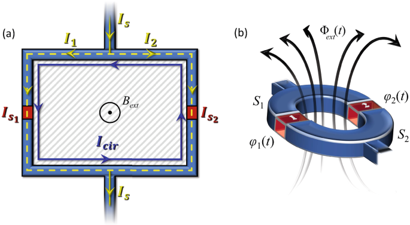
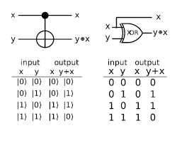
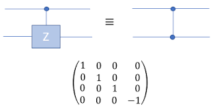

# ⚛️ Superconducting Qubits

Superconducting qubits are one of the leading platforms for quantum computing. They are fabricated using superconducting materials and Josephson junctions, and they operate at cryogenic temperatures. These systems are especially valued for their compatibility with standard semiconductor fabrication techniques and fast gate operation speeds. Over the past decade, rapid improvements in materials, control systems, and qubit coherence have made this architecture the basis for many commercial quantum processors.

## 🔍 Overview

Superconducting qubits are artificial atoms made from superconducting circuits. Their nonlinearity comes from Josephson junctions, which enable a two-level quantum system suitable for qubit encoding. These devices leverage macroscopic quantum coherence, where entire electrical currents flow in superposition states — a phenomenon not seen in conventional electronics.

  
  
<em>
  Figure 1: SuperConducting Qubit Circuit
  <em>

**Key Properties**:

| Feature               | Typical Value/Approach                 |
| --------------------- | -------------------------------------- |
| Qubit Type            | Transmon, Xmon, Flux, Fluxonium        |
| Gate Times            | Single: 10–100 ns; Two-qubit: <1 µs    |
| Coherence Times (T1)  | 50–500 µs                              |
| Operating Temperature | ~10–20 mK                              |
| Gate Fidelity         | >99% (state-of-the-art devices)        |
| Scalability           | 50–100+ qubits (commercial prototypes) |
| Error Correction      | Surface codes in active development    |

## 🧠 Core Concepts

### What is a Josephson Junction?

A Josephson junction is made by placing a thin insulator between two superconductors. It behaves like a nonlinear inductor, which is essential for creating discrete energy levels in superconducting circuits.

The nonlinearity introduced by the Josephson junction allows for the creation of a qubit from the two lowest energy levels of the circuit's anharmonic potential. The quantum behavior of the circuit is governed by a Hamiltonian that includes both Josephson energy ($E_J$) and charging energy ($E_C$). This balance is crucial to defining the energy spacing of qubit levels and suppressing noise.

  
  
<em>
  Figure 2: Different kinds of Josephson Junctions
  <em>

## 🧩 Qubit Types

### Transmon/Xmon

- Most widely used.
- Large capacitor shunt reduces sensitivity to charge noise.
- Operates in the $E_J \gg E_C$ regime for stability.

The transmon is a modified version of the Cooper-pair box, optimized for coherence by sacrificing some degree of anharmonicity. Its planar structure allows for easier integration into 2D chip layouts. The Xmon is a variation optimized for scalability and used extensively by Google.

  
  
<em>
  Figure 3: Transmon Xmon Qubit Circuits
  <em>

### Flux Qubit

- Consists of a superconducting loop with multiple Josephson junctions.
- Qubit states correspond to circulating currents (clockwise/counterclockwise).
- Sensitive to magnetic flux.

Flux qubits offer high anharmonicity and fast gate speeds. However, they are more susceptible to flux noise, which limits coherence unless mitigation techniques are employed. Flux noise arises from microscopic magnetic fluctuations, and remains a key research challenge.

  
  
<em>
  Figure 4: Flux Qubit Circuit Diagram
  <em>

### Fluxonium/Phase Qubits

- Variants with large inductance for enhanced coherence.
- Explored for noise resilience and longer lifetimes.

Fluxonium qubits introduce superinductors to suppress charge dispersion and increase robustness. These designs are often used in research labs to explore high-coherence designs. Phase qubits were among the earliest designs and are now mostly of historical interest.

  
  
<em>
  Figure 5: Simple Fluxonium Qubit Circuit
  <em>

### 3D Circuit QED Qubits

- Embedded in high-Q 3D microwave cavities.
- Achieve longer coherence times due to reduced dielectric loss.

3D cavity implementations physically separate the qubit from substrate-related losses. This architecture is often used in precision experiments that push the boundaries of coherence time.

## 🎸 Circuit QED

Circuit QED (Quantum Electrodynamics) refers to the interaction of qubits with microwave photons in resonators. It forms the backbone of qubit readout and gate control.

**Features:**

- Strong coupling between qubit and resonator.
- Enables high-fidelity qubit state measurement.
- Allows for multiplexed readout and control.

Circuit QED also supports dispersive readout, where the qubit state is inferred by the frequency shift of the resonator, avoiding energy exchange that could disturb the system. Multiplexing allows multiple qubits to be read out using a single transmission line, simplifying scaling.

 🧠 Beginner Note

Think of the resonator as a microwave version of a guitar string — when the qubit changes state, it shifts the tone slightly. That shift tells us the state of the qubit.

## 🔗 Entangling Gates

Two-qubit gates are essential for universal quantum computation. In superconducting circuits, entanglement is typically achieved by coupling qubits through microwave resonators or tunable couplers.

**Common Gate Methods**:

- **Cross-Resonance (CR)**: Drive one qubit at the frequency of a neighbor to implement a CNOT-like gate.
- **CZ (Controlled-Z)**: Use energy level detuning and interactions to impart a controlled phase.

<table>
  <tr>
    <td align="center">
       
      <em>Figure 7: Cross resonance gates</em>
    </td>
    <td align="center">
       
      <em>Figure 8: Controlled-Z Gate</em>
    </td>
  </tr>
</table>

**Gate Fidelity**:

- Modern devices achieve >99% fidelity.

Recent advances include tunable couplers that allow on-demand activation and deactivation of qubit interactions, which reduces residual crosstalk and improves multi-qubit fidelity. Microwave pulse shaping and optimal control theory also help enhance performance.

## 🌫️ Sources of Decoherence

Decoherence remains a critical challenge for scaling superconducting qubits. The major sources include:

- **Charge noise**: Fluctuations in local electric fields.
- **Flux noise**: Magnetic field instabilities.
- **Material defects**: Two-level systems (TLS) in the dielectric or surface oxides.
- **Thermal noise**: Even stray thermal photons can cause errors at cryogenic temperatures.

Recent advancements in materials and 3D cavity design have helped extend $T_1$ (energy relaxation time) from tens to hundreds of microseconds. These improvements stem from better substrate cleaning, optimized fabrication, and use of epitaxial junctions.

Additionally, surface treatment techniques and better shielding against electromagnetic interference have helped push coherence times to their current limits.

 🧠 Beginner Note

 Decoherence is like a quantum system getting 'distracted' by its environment — it loses its quantum memory.

## 🛡️ Error Correction

Superconducting qubits are currently used in experiments implementing **surface codes**, one of the most promising error correction strategies.

**Surface Code Features**:

- Arranges physical qubits in a 2D grid.
- Performs stabilizer checks to detect and correct errors.
- Requires many physical qubits per logical qubit (e.g., ~1000:1 ratio).

The surface code is tolerant to local noise and scalable to large systems, making it suitable for fault-tolerant quantum computing. Research continues to improve the efficiency and threshold of these codes, potentially lowering the hardware overhead needed. Leading efforts are also exploring color codes, lattice surgery, and low-overhead alternatives.

## 💼 Commercial Development

Companies such as **IBM**, **Google**, and **Rigetti** have built superconducting quantum processors with 50–100+ qubits.

- IBM’s roadmap includes modular, cryogenic chips interconnected via microwave buses.
- Google’s Sycamore chip was used in quantum supremacy experiments.
- Rigetti focuses on hybrid cloud-accessible quantum processors with tunable qubits.

Startups and academic institutions are also exploring novel layouts, including cryo-CMOS integration and scalable control systems, to push superconducting platforms toward practical applications.

 🔗 Example

 Try running a quantum program on IBM’s real superconducting chip via [IBM Quantum Experience](https://quantum-computing.ibm.com/).

## Key Learning Resources

1. **[Circuit QED Primer](https://arxiv.org/abs/0912.3902)**
   Introduces coupling of superconducting qubits with resonators.

2. **[Transmon Qubit Design](https://arxiv.org/pdf/1610.02208)**
   Detailed Hamiltonian, design evolution, and coherence trade-offs.

3. **[State of Quantum Hardware](https://arxiv.org/abs/2208.08064)**
   Reviews challenges, fidelity progress, and fault tolerance goals.

4. **[MIT Lecture Notes](https://ocw.mit.edu/courses/6-763-applied-superconductivity-fall-2005/pages/lecture-notes/)**
   Covers Josephson physics, BCS theory, and quantum circuits.
